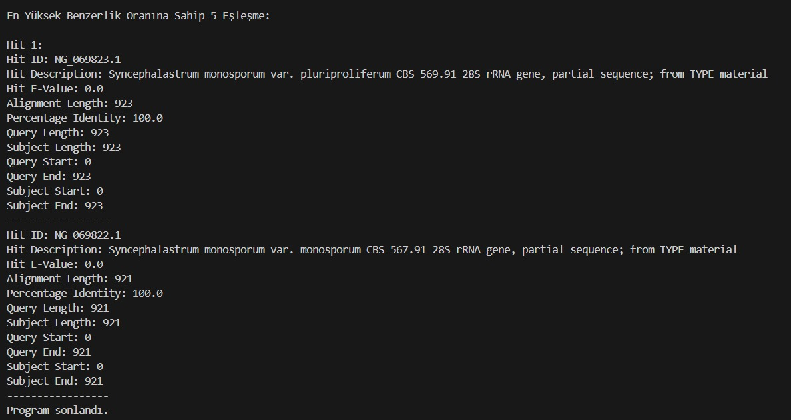
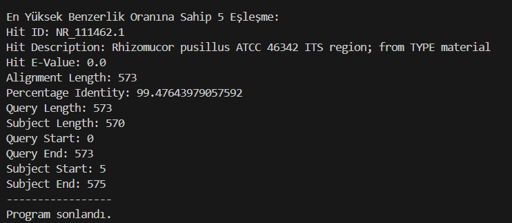

# Fungal-rRNA-Sequence-Analysis

Mantarların tanımlanması için ribozomal RNA bölgelerinden 18S, 28S ve ITS bölgeleri kullanılmaktadır. Ancak bunlardan ITS dizisi tür düzeyinde tanımlama için aynı türün bireyleri arasındaki farklılığının az, değişik türler arasındaki farklılığının fazla olması nedeniyle altın standart olarak kullanılmasını sağlamıştır.
  

Ökaryotik canlılarda bu gen bölgesi 18S small subunit (SSU), 28S large subunit (LSU) ve 5.8S subunit oluşmaktadır. Bu üç gen kompleksi arasında onları birbirinden ayıran ITS bölgeleri bulunur. ITS1 ve ITS2 bölgeleri türler arasında değişiklikler göstermektedir.
   

Resim 1: Ribozomal DNA gen kompleksi  

Ancak bazı durumlarda bu gen bölgeleri yeterli gelmeyebilir. Bu gibi durumlarda farklı bölgelerde değerlendirilmeye alınmaktadır. Bu çalışmada da ITS bölgelerinin yanı sıra 18S rRNA ve 28S rRNA bölgeleri değerlendirmeye alınmıştır. 
  

Güvenilir bir tanımlama yapmak için National Center for Biotechnology Information (NCBI)'ın referans sequence dosyalarının olduğu RefSeq Targeted Loci Project Fungi (Fungi FTP:(<https://ftp.ncbi.nlm.nih.gov/refseq/TargetedLoci/Fungi/>)) dizilerini [Biopython](https://github.com/biopython) kütüphanesiyle analiz edildi.
  

#### Gereklilikler
- Visual Studio Code  
- Biopython

##### 1. Adım: Convert to Fasta
 

Sekans Analiz cihazından veriler .fasta uzantılı olarak çıkmaktadır. NCBI'den referans alınan veriler ise .gbff uzantılıdır. Bu yüzden referans alacağımız dosyaları .fasta formatına çevrilmiştir.

##### 2. Adım: Fungal-rRNA-Sequence-Analysis
 

Sequence Analiz burada yapılmıştır. Öncelikle Biopython kütüphanesi indirilip kurulmuştur. Daha sonra aynı dizinde Fungal-rRNA-Sequence-Analysis adında bir klasör oluşturulup kodlar bu klasör içinde yazılmıştır. Klasör içinde ayrıca Türler(Referans alınacak suşların bulunduğu klasör) ve Fastalar(Analizi yapılacak .fasta dosyaları) adlı klasör oluşturulup gereken dosyalar konularak analiz yapılmaktadır.Analiz yapılırken benzerlik oranı en yüksek 5 tür yazdırılmıştır.

##### Örnek Çıktılar

Resim 2: Örnek 1
 

Resim 3: Örnek 2